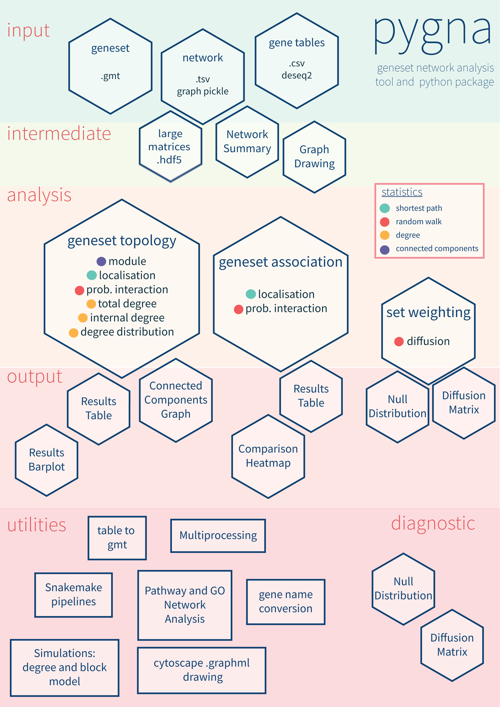

# PyGNA: a Python framework for geneset network analysis

PyGNA is a framework for statistical network analysis of high-throughput experiments. It can
be used both as a standalone command line application or it can be used as API
to develop custom analyses.

For an overview of PyGNA functionalities check the infographic below or dive into our [Getting started](#getting-started) tour.

## Installation

The easiest and fastest way to install `pygna` using `conda`:

    $ conda install -c stracquadaniolab -c bioconda -c conda-forge pygna

Alternatively you can install it through `pip`:

    $ pip install pygna

We also provide a docker image installation with the latest version of PyGNA.
It can be easily executed from the command line from DockerHub:

    $ docker run stracquadaniolab/pygna/pygna:latest

or GitHub Packages:

    $ docker run docker.pkg.github.com/stracquadaniolab/pygna/pygna:latest

which will show the PyGNA command line help.

## Getting started

A typical `pygna` analysis consists of 3 steps:

1. Generate the RWR and SP matrices for the network you are using ( once they are generated, you won't need to repeat the same step again)
2. Make sure that the input genesets are in the right format. If a network uses entrez ID, and your file is in HUGO symbols, use the pygna utility for the name conversion.
3. Run the analysis you are interested into.
4. Once you have the output tables, you can choose to visualize one or more plots.

Otherwise you can check our [snakemake workflow](https://github.com/stracquadaniolab/workflow-pygna) for the full geneset analysis;
our workflow contains sample data that you can use to familiarize with our software.

The examples below show some basic analysis that can be carried out with pygna.

### Example 1: Running pygna GNT analysis

Running `pygna` on this input as follows:

    $ cd ./your-path/min-working-example/

    $ pygna build-rwr-diffusion barabasi.interactome.tsv --output-file interactome_RWR.hdf5

    $ pygna test-topology-rwr barabasi.interactome.tsv disgenet_cancer_groups_subset.gmt interactome_RWR.hdf5 table_topology_rwr.csv --number-of-permutations 1000 --cores 4

    $ pygna paint-datasets-stats table_topology_rwr.csv barplot_rwr.pdf

You can look at the plot of the results in the `barplot_rwr.pdf` file, and the corresponding table in  `table_topology_rwr.csv`.

### Example 2: Running pygna GNA analysis

    $ cd ./your-path/min-working-example/

skip this step if the matrix is already computed

    $ pygna build-RWR-diffusion barabasi.interactome.tsv --output-file interactome_RWR.hdf5

The association analysis is run N x M times (N number of genesets, M number of pathways), we use only 50 permutations in this example to avoid long computations; however, the recommended value is 1000.

    $ pygna test-association-rwr barabasi.interactome.tsv disgenet_cancer_groups_subset.gmt interactome_RWR.hdf5 table_association_rwr.csv -B disgenet_cancer_groups_subset.gmt --keep --number-of-permutations 100 --cores 4

If you don't include the --results-figure flag at the comparison step, plot the matrix as follows

    $ pygna paint-comparison-matrix table_association_rwr.csv heatmap_association_rwr.png --rwr --annotate

The -k flag, keeps the -B geneset and permutes only on the set A.

If setname B is not passed, the analysis is run between each couple of setnames in the geneset.

    $ pygna test-association-rwr barabasi.interactome.tsv disgenet_cancer_groups_subset.gmt interactome_RWR.hdf5 table_within_comparison_rwr.csv --number-of-permutations 100 --cores 4

    $ pygna paint-comparison-matrix table_within_comparison_rwr.csv heatmap_within_comparison_rwr.png --rwr --single-geneset

You can look at the plot of the results in the `heatmap_within_comparison_rwr.png` file, and the corresponding table in  `table_within_comparison_rwr.csv`.

## Documentation

The official documentation for `pygna` can be found on [readthedocs](https://pygna.readthedocs.io/).

## Authors

- Viola Fanfani (v.fanfani@sms.ed.ac.uk): lead developer and mantainer.
- Fabio Cassano (fabio.cassano@ed.ac.uk): support.
- Giovanni Stracquadanio (giovanni.stracquadanio@ed.ac.uk): corresponding author.

## Citation

A unified framework for geneset network analysis. Viola Fanfani, Giovanni Stracquadanio. bioRxiv 699926; doi: https://doi.org/10.1101/699926

## Issues

Please post an issue to report a bug or request new features.
