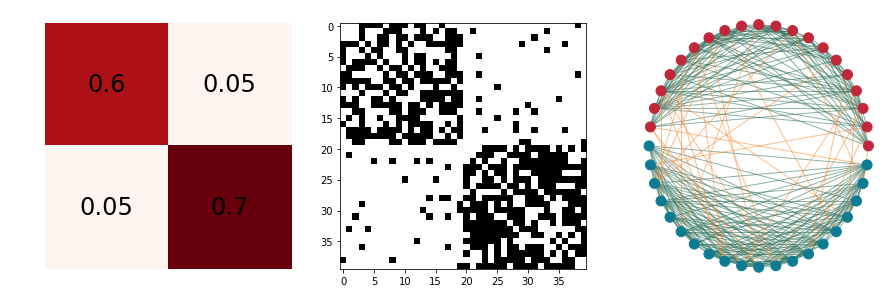
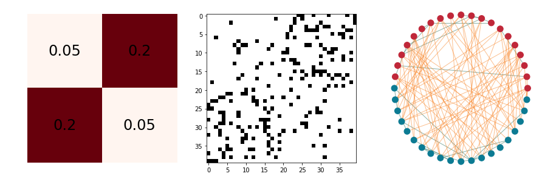
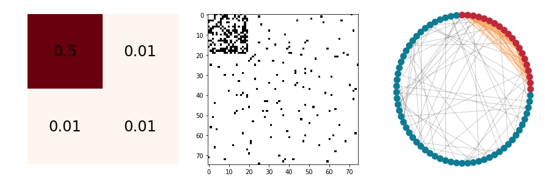
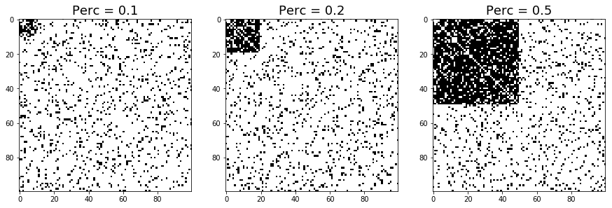
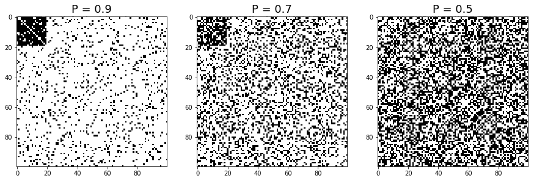

Stochastic Block Model Simulations
==================================

This notebook is used to illustrate how the stochastic block model
simulations have been prepared for PyGNA.

In order to have an understandable figure of the different models, we
are going to use different values for the parameters compared to the
actual ones. We noticed that on a 1000 nodes network showing different
clusters in a 2d representation is very diffult.

Usual representation of a stochastic block model
------------------------------------------------

First of all, we show here what the different parameters of a block
model represent. In a stochastic block model, the connectivity of the
network is defined by the probability of connection of the different
nodes. Each node belongs to a block, one parameter, :math:`p_{ii}`
controls the probability of connection within the i-th cluster while the
:math:`p_{ij}` parameters control the probability of connection between
block i and j.

Here are some examples of a SBM with 2 blocks, each of them with 20
nodes.

For each of the configurations we show: the SBM matrix, the adjacency
matrix, and the graph.

We are going to show a strongly assortative network, a strongly
disassortative network, and an intermediate case.

PyGNA models
===============

In order to simulate a realistic network, we use the stochastic block
model to generate both the whole network and the clusters of intereset.

To do so, we have to define a larger block, whose probability of
connection represents the general connectivity of the network, and a
smaller block which is going to be the cluster of interest.

All the simulations in PyGNA are done by parametrising the number of
nodes in each block and the SMB matrix.

Two clusters SBM
================

In the simplest model, we parametrise two blocks by varying the number
of nodes in each cluster and the SBM matrix.

With the parameter :math:`perc` we specify the percentage of the total
number of nodes that is assigned to the cluster of interest. Instead,
the SBM matrix is parametrised by varying :math:`p_00` and
:math:`p_{01}=p_{10}=p_{11 = 1-p-{00}}`.

Percentage of nodes
---------------------

Here is how the adjacency matrix varies with different percentages of
nodes in the blocks.

Connection probabilities
---------------------------

Here we show how the adjacency matrix varies for different probabilities
of connection.

