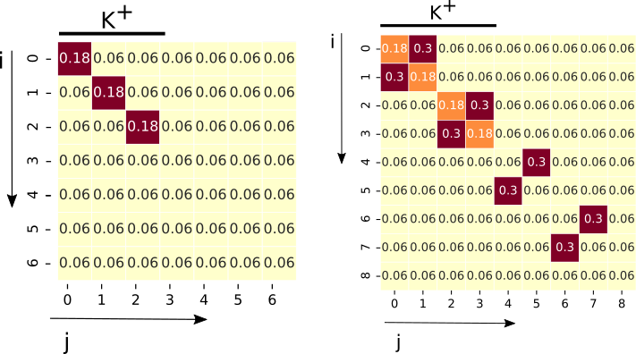
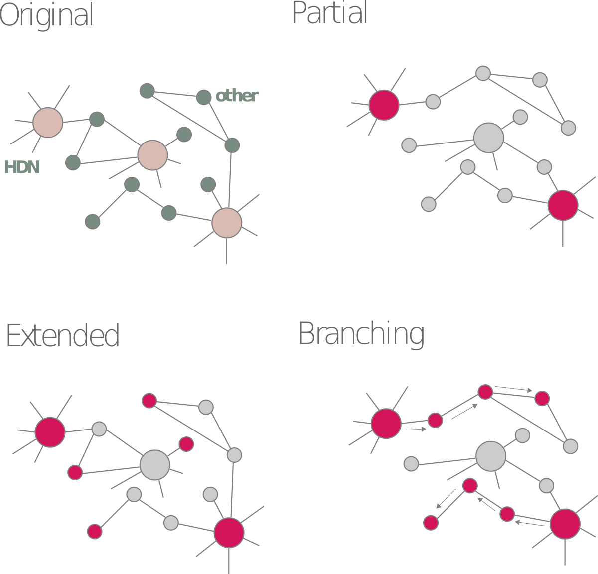

Benchmarking
==================

We have created a framework for testing the performance of Geneset Network
analysis: it allows the experimenter to create simulated networks specifying
many parameters. The model we use is the Stochastic Block Model and Degree Model
that provides a way to create the network and identify clusters into it.

Stochastic Block Model
--------------------------

We provide both functions to generate stochastic block model simualated data like below.
On the left is the model used for GNT benchmarking and on the right the one for GNA benchmarking.

For a quick primer on SBM, you can check the page below:

.. toctree::
    :maxdepth: 1

    show_sbm

For each simulation we return both the whole network and a gmt file with the blocks.

GNT Benchmarking
+++++++++++++++++++

.. code-block:: text

        usage: pygna generate-gnt-sbm [-h] [-N N] [-b BLOCK_SIZE] [--d D]
                                    [-f FOLD_CHANGE] [--descriptor DESCRIPTOR]
                                    output-tsv output-gmt

            This function generates 3 blocks with d*fold_change probability
            and other 3 blocks with d probability.
            Make sure that 6*cluster_size < N

        positional arguments:
        output-tsv            output network filename
        output-gmt            output geneset filename, this contains only the blocks

        optional arguments:
        -h, --help            show this help message and exit
        -N N, --N N           number of nodes in the network (default: 1000)
        -b BLOCK_SIZE, --block-size BLOCK_SIZE
                                size of the first 6 blocks (default: 50)
        --d D                 baseline probability of connection, p0 in the paper
                                (default: 0.06)
        -f FOLD_CHANGE, --fold-change FOLD_CHANGE
                                positive within-block scaling factor for the
                                probability of connection, Mii = fold_change * d
                                (alpha parameter in the paper) (default: 2.0)
        --descriptor DESCRIPTOR
                                descriptor for the gmt file (default: 'mixed_sbm')

GNA Benchmarking
+++++++++++++++++++

.. code-block:: text

        usage: pygna generate-gna-sbm [-h] [--output-gmt2 OUTPUT_GMT2] [-N N]
                                    [-b BLOCK_SIZE] [--d D] [--fc-cis FC_CIS]
                                    [--fc-trans FC_TRANS] [-p PI]
                                    [--descriptor DESCRIPTOR] [-s SBM_MATRIX_FIGURE]
                                    output-tsv output-gmt

            This function generates benchmark network and geneset to test
            the crosstalk between two blocks.

            This function generates 4 blocks with d*fold change probability
            and other 4 blocks with d probability.
            The crosstalk is set both between the the first 4 blocks and the others.

            Make sure that 8*cluster_size < N

        positional arguments:
        output-tsv            output_network
        output-gmt            output geneset filename, this contains only the blocks

        optional arguments:
        -h, --help            show this help message and exit
        --output-gmt2 OUTPUT_GMT2
                                mixture output geneset filename, this contains the
                                mixture blocks (default: -)
        -N N, --N N           number of nodes in the network (default: 1000)
        -b BLOCK_SIZE, --block-size BLOCK_SIZE
                                size of the first 8 blocks (default: 50)
        --d D                 baseline probability of connection, p0 in the paper
                                (default: 0.06)
        --fc-cis FC_CIS       positive within-block scaling factor for the
                                probability of connection, Mii = fc_cis * d (alpha
                                parameter in the paper) (default: 2.0)
        --fc-trans FC_TRANS   positive between-block scaling factor for the
                                probability of connection, (beta parameter in the
                                paper) (default: 0.5)
        -p PI, --pi PI        percentage of block-i nodes for the genesets made of
                                block-i and block-j. Use symmetrical values (5,95),use
                                string comma separated (default:
                                '4,6,10,12,88,90,94,96')
        --descriptor DESCRIPTOR
                                'crosstalk_sbm'
        -s SBM_MATRIX_FIGURE, --sbm-matrix-figure SBM_MATRIX_FIGURE
                                shows the blockmodel matrix (default: -)

High Degree Nodes simulations
-------------------------------

Generate the network and geneset file
++++++++++++++++++++++++++++++++++++++++

The high degree nodes (HDN) model generates networks with a controllable number
of hubs, HDNs, whose probability of connection with another node
is higher than the baseline probability assigned to any other node in the
network.

.. code-block:: text

    usage: pygna generate-hdn-network [-h] [--n-nodes N_NODES]
                                    [--network-prob NETWORK_PROB]
                                    [--hdn-probability HDN_PROBABILITY]
                                    [--hdn-percentage HDN_PERCENTAGE]
                                    [--number-of-simulations NUMBER_OF_SIMULATIONS]
                                    output-folder prefix

        This function generates a simulated network using the VIP model

    positional arguments:
    output-folder         the output folder path
    prefix                the prefix of the file to be saved

    optional arguments:
    -h, --help            show this help message and exit
    --n-nodes N_NODES     the number of nodes in the network (default: 1000)
    --network-prob NETWORK_PROB
                            probability of connection in the network (default:
                            0.005)
    --hdn-probability HDN_PROBABILITY
                            probability of connection of the HDNs (default: 0.3)
    --hdn-percentage HDN_PERCENTAGE
                            percentage of HDNs (default: 0.05)
    --number-of-simulations NUMBER_OF_SIMULATIONS

Add genesets
++++++++++++++++++++++++++++++++++++++++

Given the generated network and node list of HDNs, we can then generate
novel genesets made of mixtures of the two.

We show the idea of how they are generated below. First is the
original network with a number of HDNs, then the partial, extended, and branching genesets.

Add extended genesets
^^^^^^^^^^^^^^^^^^^^^^^^^^^^^^^^

.. code-block:: text

    usage: pygna hdn-add-extended [-h] [--hdn-set HDN_SET] [-g GENERAL_SET]
                                [--reps REPS] [-p PERCENTAGE_EXTENDED_VIPS]
                                [--ratio-others RATIO_OTHERS]
                                [-o OUTPUT_GENESET_FILE]
                                input-geneset-file

        Creates new genesets from the vip list, number of genesets and portion of genes
        can be specified by input. The final new geneset is going to be formed by:
        percentage ev * HDN_total + ratio* percentage ev*vips total.

    positional arguments:
    input-geneset-file    input geneset containing the sets to be merged

    optional arguments:
    -h, --help            show this help message and exit
    --hdn-set HDN_SET     setname of the HDNs in the geneset (default:
                            'cluster_1')
    -g GENERAL_SET, --general-set GENERAL_SET
                            other setname in the geneset (default: 'cluster_0')
    --reps REPS           number of new genesets made of part of HDNs (default:
                            3)
    -p PERCENTAGE_EXTENDED_VIPS, --percentage-extended-vips PERCENTAGE_EXTENDED_VIPS
                            percentage of HDNs in the new genesett (default:
                            '[0.2]')
    --ratio-others RATIO_OTHERS
                            ratio of genes to add to HDNs (default: '[2,2.5,3,4]')
    -o OUTPUT_GENESET_FILE, --output-geneset-file OUTPUT_GENESET_FILE
                            if no output gmt filename is passed, the data is added
                            to the input file (default: -)

Add partial genesets
^^^^^^^^^^^^^^^^^^^^^^^^^^^^^^^^
.. code-block:: text

    usage: pygna hdn-add-partial [-h] [--hdn-set HDN_SET] [-g GENERAL_SET]
                                [-r REPS] [-p PERCENTAGE_PARTIAL_VIPS]
                                [-o OUTPUT_GENESET_FILE]
                                input-geneset-file

        Creates new genesets from the vip list, number of genesets and portion of
        genes can be specified by input.

    positional arguments:
    input-geneset-file    input geneset containing the sets to be merged

    optional arguments:
    -h, --help            show this help message and exit
    --hdn-set HDN_SET     setname of the HDNs in the geneset (default:
                            'cluster_1')
    -g GENERAL_SET, --general-set GENERAL_SET
                            other setname in the geneset (default: 'cluster_0')
    -r REPS, --reps REPS  number of new genesets made of part of vips (default:
                            3)
    -p PERCENTAGE_PARTIAL_VIPS, --percentage-partial-vips PERCENTAGE_PARTIAL_VIPS
                            percentage of HDNs in the new geneset (default:
                            '0.1,0.2,0.5')
    -o OUTPUT_GENESET_FILE, --output-geneset-file OUTPUT_GENESET_FILE
                            if no output gmt filename is passed, the data is added
                            to the input file (default: -)

Add branching genesets
^^^^^^^^^^^^^^^^^^^^^^^^^^^^^^^^

.. code-block:: text

    usage: pygna hdn-add-branching [-h] [--hdn-set HDN_SET] [-g GENERAL_SET]
                                [--number-of-hdns NUMBER_OF_HDNS]
                                [--number-of-reps NUMBER_OF_REPS]
                                [--output-geneset-file OUTPUT_GENESET_FILE]
                                [--output-graph-file OUTPUT_GRAPH_FILE]
                                input-geneset-file network-file

        Creates new genesets from the vip list, new genesets are created adding 1 step
        nodes to vips. The new genes are created as branches.

    positional arguments:
    input-geneset-file    input geneset containing the sets to be merged
    network-file          network filename

    optional arguments:
    -h, --help            show this help message and exit
    --hdn-set HDN_SET     setname of the HDNs in the geneset (default:
                            'cluster_1')
    -g GENERAL_SET, --general-set GENERAL_SET
                            other setname in the geneset (default: 'cluster_0')
    --number-of-hdns NUMBER_OF_HDNS
                            number of seed HDNs to start adding nodes (default: 3)
    --number-of-reps NUMBER_OF_REPS
                            number of new genesets created for each condition
                            (default: 3)
    --output-geneset-file OUTPUT_GENESET_FILE
                            if no output gmt filename is passed, the data is added
                            to the input file (default: -)
    --output-graph-file OUTPUT_GRAPH_FILE
                            if graphml file is passed the network with labels is
                            written (default: -)

General model (old)
++++++++++++++++++++

This function is still working, however now networkx provides a function
to generate SBM networks. We will then change this function to use
directly networkx for the generation.

All the parameters can be specified in a yaml file that is passed as input. As output,
we obtain a file with the network and a .gmt file where the nodes have been grouped
by the respective cluster they are in.

Example yaml
^^^^^^^^^^^^^^^

.. code-block:: yaml

    BlockModel :
      n_nodes: 100
      matrix: [[0.8,0.1,0.1],[0.1,0.8,0.1],[0.1,0.1,0.8]]
      nodes: ""
      nodes_in_cluster: None
    Simulations:
      n_simulated: 1
      output_folder: "/home/viola/Desktop/geneset-network-analysis/processed_data/simulated_data/"
      suffix: attempt1

The **Simulations** parameters are used to specify the number and name of the output:

+ ``n_simulated`` we can specify the number of networks we want to generate with the same settings
+ ``output_folder`` specifies the folder where the output files are going to be saved
+ ``suffix`` is the suffix used for the output.

For each simulated datasets there are two output files:
- suffix_network_$simulation.tsv : the network file
- suffix_genes_$simulation.gmt : the gene list grouped by cluster

The **BlockModel** parameters are those used to generate the SBM:

+  ``n_nodes`` number of nodes of the network
+  ``matrix`` SBM matrix
+  ``nodes: ""`` names of the nodes, if not specified N$number
+  ``nodes_in_cluster: None``: Number of nodes thatwe want to assign to each cluster

Example simulated dataset generation and Analysis
^^^^^^^^^^^^^^^^^^^^^^^^^^^^^^^^^^^^^^^^^^^^^^^^^^^^

**Generation of the network and genesets**

.. code-block:: bash

    $ pygna generate-simulated-network ../simulationBM.yaml
