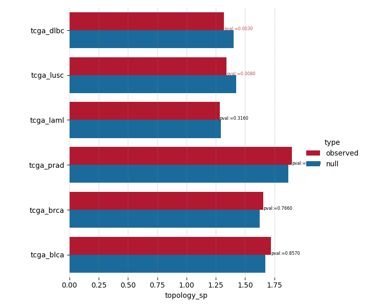

Tutorial
========

General Usage
--------------

Data Input/Output
+++++++++++++++++

PyGNA relies requires two data sources, a network and a geneset. Regardless of
the test, the genes in the geneset are mapped to the input network (e.g. BioGrid) and
then statistical tests are carried out.

Networks are read as tab separated text files, where edges are represented by a node pair.

Genesets use the GMT format, where each geneset is reported as:
`name \tab descriptor \tab gene1 \tab gene2`

Since GMT file can have multiple genesets, PyGNA can either run the analyses on all
of them or on a user-specified subset.

Results are stored in CSV files, along with the parameters of the analysis.
Results can be easily visualised using PyGNA plotting utilities, and save either
as PDF or PNG files.

Matrix computation
++++++++++++++++++

Computing the shortest path and the interaction probabilities between each pair
of nodes in the network can be computationally taxing. However, since matrices
are never modified by statistical tests, they can be computed as part of a
pre-processing step.

For this reason, we have implemented a separate step for evaluating and saving
the shortest path and RWR matrices.

.. code-block:: bash

    $ pygna build-rwr-diffusion barabasi.interactome.tsv --output-file interactome_RWR.hdf5

.. code-block:: bash

    $ pygna build-distance-matrix barabasi.interactome.tsv interactome_SP.hdf5

Analysis
+++++++++++++++++

PyGNA provides commands for running geneset network topology (GNT) and geneset
network analysis (GNA) tests. Running `pygna -h` shows all the available
analyses, whereas extend documentation can be found :ref:`CLI` here.

Here a simplified structure of the available tests:

- **geneset network topology**:
    - module
    - internal degree
    - total degree
    - shortest path
    - random walk

- **geneset network association**:
    - shortest path
    - random walk

The analyses commands have all the same interface; for example, the available RWR GNT analysis
options can be checked by running:

.. code-block:: bash

    $ pygna test-topology-rwr -h

Complete analysis of one geneset
--------------------------------

In case you have your own geneset you can completely characterise it using PyGNA
as follows (names of min_working_example).

INPUT: <network> and <geneset>, and/or a <geneset_pathway> to run the
association analysis.

OUTPUT: <network_sp>.hdf5, <network_rwr>.hdf5, <table_results_test>_<test>.csv

Generate the network matrices:

.. code-block:: bash

    $ pygna build-distance-matrix <network> <network_sp>.hdf5
    $ pygna build-rwr-diffusion <network> --output-file <network_rwr>.hdf5

Topology tests:

.. code-block:: bash

    $ pygna test-topology-module <network> <geneset> <table_results_test>_topology_module.csv --number-of-permutations 100 --cores 4
    $ pygna test-topology-rwr <network> <geneset> <network_rwr>.hdf5 <table_results_test>_topology_rwr.csv --number-of-permutations 100 --cores 4
    $ pygna test-topology-internal-degree <network> <geneset> <table_results_test>_topology_internal_degree.csv --number-of-permutations 100 --cores 4
    $ pygna test-topology-sp <network> <geneset> <network_sp>.hdf5 <table_results_test>_topology_sp.csv --number-of-permutations 100 --cores 4
    $ pygna test-topology-total-degree <network> <geneset> <table_results_test>_topology_total_degree.csv --number-of-permutations 100 --cores 4

Association tests:

.. code-block:: bash

    $ pygna test-association-sp <network> <geneset> <network_sp>.hdf5 <table_results_test>_association_sp.csv -B <geneset_pathways> --keep --number-of-permutations 100 --cores 4
    $ pygna test-association-rwr <network> <geneset> <network_rwr>.hdf5 <table_results_test>_association_rwr.csv -B <geneset_pathways> --keep --number-of-permutations 100 --cores 4

Analysis of a geneset from a table (e.g. DeSeq2)
------------------------------------------------

In many workflows, the genes to analyse are stored in a table-like format. Hence,
we provide a function to create a GMT geneset from a table, with the possibility
of applying a filter to the data. You can even just use it to return a gmt with
all the genes in a column by applying a dummy filter.

**NOTE**: In case you would like to apply more filters, just use the output_csv
command, instead of GMT, in order to only filter the original data and return
the table in the original format.

Here, for example, we obtain a GMT file of the differentially expressed genes
computed using DeSeq2, by selecting genes with padj<0.01.

.. code-block:: bash

    $ pygna geneset-from-table <deseq>.csv diff_exp <deseq>.gmt --descriptor deseq

PyGNA implements a generic interface to filter any CSV file. Filters are applied
s the values in the filter_column (for example pvalue) and cutting using the
alternative and threshold parameters to specify what the filter should be. Bare
in mind the filter is supposed to be applied to **numerical values**. The output
gmt will have the gene-names in the <name_column>

.. code-block:: bash

    $ pygna geneset-from-table <filename>.csv <setname> <filename>.gmt --name-colum <gene_names_column> --filter-column <filter-col> <'less'> --threshold <th> --descriptor <descriptor string>

Pipelines
---------

PyGNA can be seamlessly integrated into Snakemake workflows, and we provide a
basic [snakemake workflow](https://github.com/stracquadaniolab/workflow-pygna)
to carry out network analysis with PyGNA.

Converting data using PyGNA
+++++++++++++++++++++++++++

One of the most important feature in pygna is the possibility to convert a file
from a format to another. PyGNA supports:

Converting into GMT format __________________________

Geneset in table-like formats (e.g. CSV) can be converted into GMT format as
follows:

.. code-block:: bash

    $ pygna geneset-from-table gene_analysis.csv brca --output-gmt brca_analysis.gmt -f significant -d significant -n genes.Entrezid -t 0.5 -a greater

It is also possible to merge different setnames in a single gmt file through the
function `generate-group-gmt`. You can override the default parameters, to match
the columns in your table.

.. code-block:: bash

    $ pygna generate-group-gmt gene_analysis.csv setnames_gmt.gmt group-col Cancer_Setnames

If you want to add a column corresponding to the EntrezID or the gene's symbol,
you can use the following command:

.. code-block:: bash

    $ pygna convert-csv mygenefile.csv e2s original-col-name EntrezID new-name-col Symbols geneset brca

Showing the results
--------------------

PyGNA generates publication-ready plots for each analysis.

For example, a barplot of the GNT RWR analysis for multiple genesets can be
generated by running:

.. code-block:: bash

    $ pygna paint-datasets-stats pygna_gnt_results.csv pygna_gnt.png

which produced a plot similar to the following:

For a complete list of the plots refer to :ref:`visualisation`

Adding GNT or GNA test statistics
-----------------------------------

PyGNA can be easily extended to run user-defined statistical tests. Check
:ref:`customization` for a full tutorial on how to do that.

.. toctree::
    :maxdepth: 1

    vignettes

Diagnostic
+++++++++++++++++++

Diagnostic tools are implemented for GNT tests. **TODO** describe them here (briefly).

**#TODO: Add example of distribution plot**
