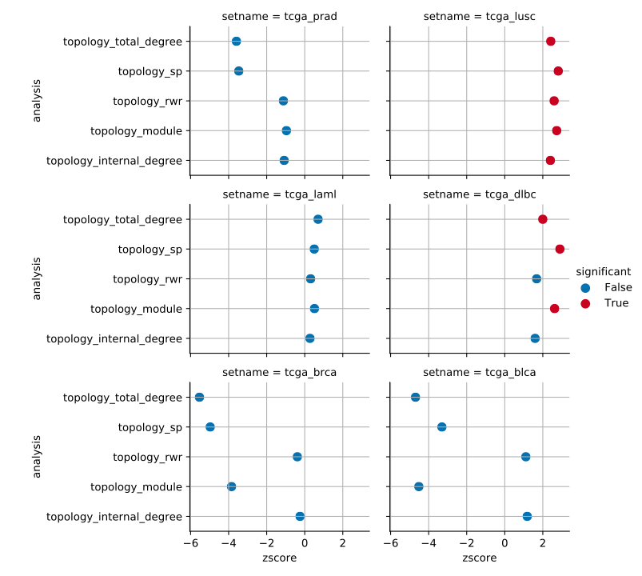
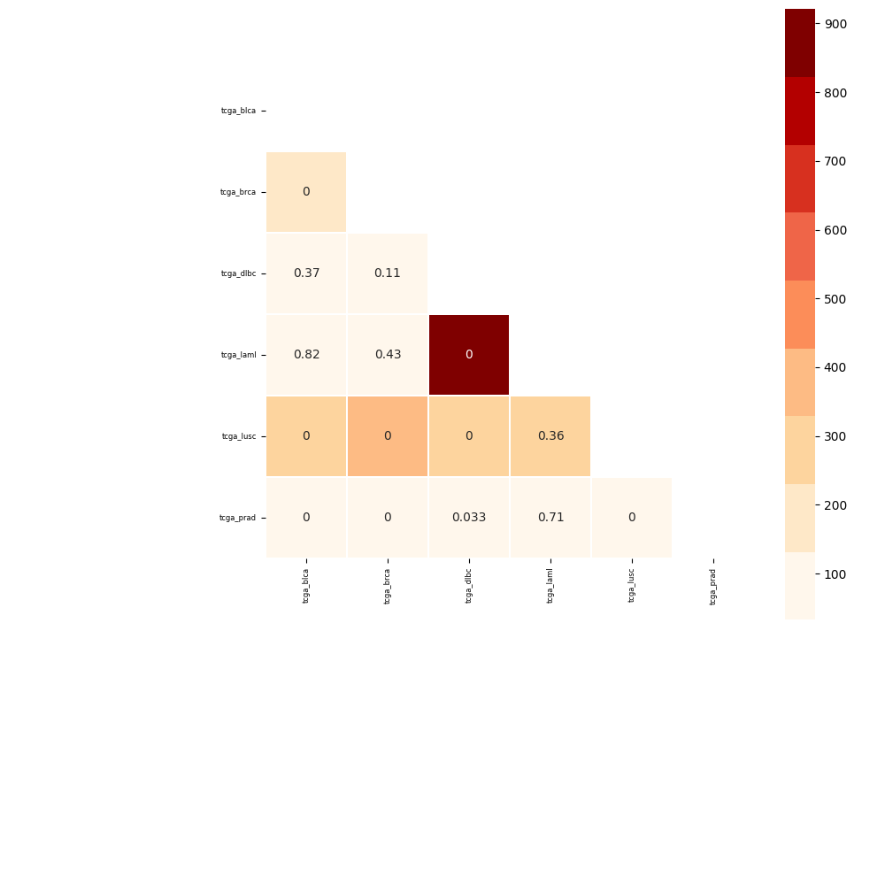
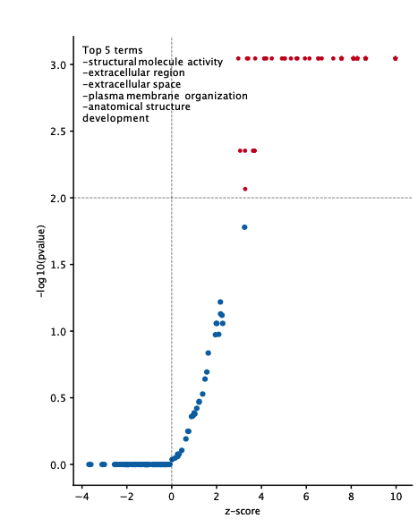

.. _visualisation:

Visualisation
----------------

Pygna offers a range of plots to visualise the results of the analysis.

GNT plots
++++++++++++

GNT barplot
^^^^^^^^^^^^^^

`paint-dataset-stats` plots the results of of a GNT test on a barplot.
Pass the results table generated by one of the functions and the output figure file (png or pdf).
In case you are using a SP test, pass also 'less' as an alternative.

.. code-block:: text

    usage: pygna paint-datasets-stats [-h] [-a ALTERNATIVE] table-filename output-file

    positional arguments:
      table-filename        pygna results table
      output-file           figure file, use pdf or png extension

    optional arguments:
      -h, --help            show this help message and exit
      -a ALTERNATIVE, --alternative ALTERNATIVE
                            'greater'

Example usage:
.. code-block:: bash

    $ pygna paint-dataset-stats table_topology_module.csv figures/barplot_module.pdf

.. image:: _static/barplot.png

GNT summary
^^^^^^^^^^^^^^

`paint_summary_gnt` plots a pointplot with a general summary for the GNT.

For example, given multiple GNT test results saved as `table_topology_<method>.csv`
we could visualise all results as follows.

.. code-block:: bash

    $ pygna paint-summary-gnt figures/summary_gnt.pdf table_topology_*

.. code-block:: text

    usage: pygna paint-summary-gnt [-h] [-s SETNAME] [-t THRESHOLD] [-c COLUMN_FILTER] [--larger] [--less-tests LESS_TESTS] output-figure [input_tables [input_tables ...]]

    positional arguments:
      output-figure         output figure filename
      input_tables          -

    optional arguments:
      -h, --help            show this help message and exit
      -s SETNAME, --setname SETNAME
                            name of the dataset (default: -)
      -t THRESHOLD, --threshold THRESHOLD
                            Value to threshold the colors (default: 0.05)
      -c COLUMN_FILTER, --column-filter COLUMN_FILTER
                            column where the threshold is applied (default: 'empirical_pvalue')
      --larger              if True the threshold is set as lower limit (default: False)
      --less-tests LESS_TESTS
                            comma separated string of the tests that are significant if lower than expected, otherwise pass empty string (default: 'topology_sp')

GNA plots
++++++++++++

GNA heatmap
^^^^^^^^^^^^^^^^^^^^^^^

`paint-comparison-matrix`  plots the results of of a GNA test.
Pass the results table generated by one of the functions and the output figure file (png or pdf).
With RWR you can specify whether the test is a RWR association, in this case a different palette and limits are sets.
Specify if the results are obtained using association with only one genesets (multiple setnames in the same file).
Pass the annotate flag to have the pvalue annotation on the plot

.. code-block:: text

    usage: pygna paint-comparison-matrix [-h] [-r] [-s] [-a] table-filename output-file

    positional arguments:
      table-filename        pygna comparison output
      output-file           output figure file, specify png or pdf file

    optional arguments:
      -h, --help            show this help message and exit
      -r, --rwr             use RWR is the table comes from a RWR analysis (default: False)
      -s, --single-geneset  use true if the comparison has been done for a single file (default: False)
      -a, --annotate        set true if uou want to print the pvalue inside the cell (default: False)

.. code-block:: bash

    $ pygna paint-comparison-matrix  table_comparison_rwr.csv figures/comparison_rwr.pdf -r -s -a

GNA association volcano
^^^^^^^^^^^^^^^^^^^^^^^

`paint-volcano-plot` plots the results of of a GNA test of association of a single geneset against multiple pathways.
Pass the results table generated by one of the functions and the output figure file (png or pdf).
From the results table, a multiple testing correction is applied and the results are those plotted.

The defined threshold are for x: zscore and :math:`y: -log10(pvalue)`

.. code-block:: text

    usage: pygna paint-volcano-plot [-h] [-r] [-i ID_COL] [--threshold-x THRESHOLD_X] [--threshold-y THRESHOLD_Y] [-a] table-filename output-file

    positional arguments:
      table-filename        pygna comparison output
      output-file           output figure file, specify png or pdf file

    optional arguments:
      -h, --help            show this help message and exit
      -r, --rwr             use RWR is the table comes from a RWR analysis (default: False)
      -i ID_COL, --id-col ID_COL
                            'setname_B'
      --threshold-x THRESHOLD_X
                            0
      --threshold-y THRESHOLD_Y
                            2
      -a, --annotate        False

